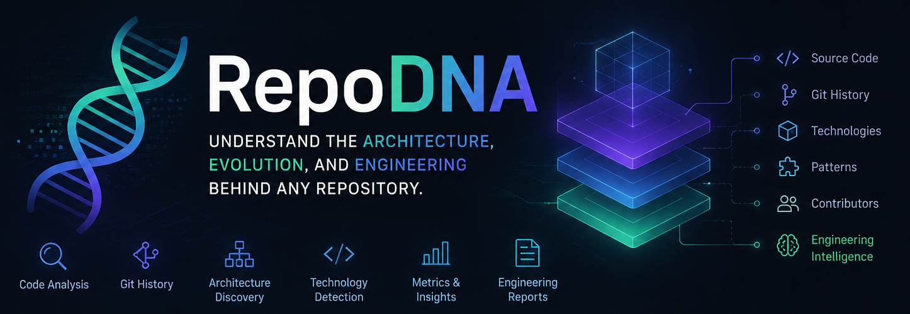

# 🧬 RepoDNA

> **Understand the architecture, evolution and engineering behind any repository.**

RepoDNA is an open-source repository analysis toolkit that combines **source code inspection**, **Git history**, **architecture discovery**, and **technology detection** to generate comprehensive engineering reports.

Instead of simply counting files or commits, RepoDNA correlates repository structure, source code, technologies, design patterns, and Git history to produce evidence-based reports that help developers understand **what a project is, how it evolved, and where engineering effort was invested.**

---

# ✨ Features

- 🔍 Automatic project detection
- 🏗 Architecture discovery
- 📦 Technology inventory
- 🧩 Gameplay and application system detection
- 📊 Project metrics
- 📈 Git contribution analysis
- 👥 Collaboration insights
- 🧠 Design pattern detection
- ⚙ Engineering signal detection
- 📄 Markdown, JSON, CSV, and HTML report generation
- 📚 Portfolio and documentation support

---

# 🎯 Why RepoDNA?

Every mature software project accumulates years of engineering decisions.

RepoDNA helps answer questions like:

- ❓ What technologies does this project use?
- ❓ Which gameplay or application systems exist?
- ❓ Which architectural patterns are present?
- ❓ Which areas did I contribute to?
- ❓ Which files changed the most?
- ❓ Which systems deserve documentation?
- ❓ How can I describe this project accurately on my CV or LinkedIn?
- ❓ What can I learn before making my first contribution?

---

# 💡 Use Cases

RepoDNA can be used for:

- 📚 Engineering documentation
- 🏛 Legacy code exploration
- 🧑‍💻 Developer onboarding
- 🎮 Game development portfolio analysis
- 📄 Career journaling
- 🔎 Technical due diligence
- 🤝 Knowledge transfer
- 📈 Project health assessment

---

# 🛣 Roadmap

### Core

- [ ] Repository detection
- [ ] Multi-language architecture analysis
- [ ] Git contribution analysis
- [ ] Report generation

### Supported Platforms

- [ ] Unity
- [ ] Unreal Engine
- [ ] Godot
- [ ] Android
- [ ] iOS
- [ ] Flutter
- [ ] .NET

### Reports

- [ ] Markdown
- [ ] HTML
- [ ] JSON
- [ ] CSV
- [ ] Interactive Dashboard

### Advanced Analysis

- [ ] Dependency graph
- [ ] Architecture diagrams
- [ ] Complexity analysis
- [ ] Code ownership analysis
- [ ] Design pattern detection
- [ ] Technical debt report
- [ ] AI-powered project summary
- [ ] Pull Request analysis

---

# 🚀 Vision

RepoDNA aims to become a universal repository analysis platform capable of helping engineers understand any software project—regardless of language, framework, or engine.

The long-term goal is to transform complex repositories into actionable engineering insights that support development, documentation, onboarding, technical reviews, and career growth.

---

# 🤝 Contributing

Contributions, ideas, feature requests, and bug reports are always welcome.

If you have suggestions for new analyzers, technologies, or report formats, feel free to open an issue or submit a pull request.

---

# 📜 License

Distributed under the **MIT License**.